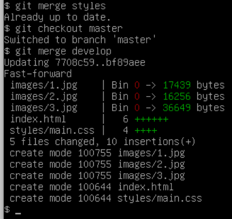

<h1>EPAM DevOps Curses</h1>
<h2>Lab 1.1 Git</h2>
<h4><ol>
<li>A new git repository was created - DevOps_online_Kiev_2021Q4. This repository 
contain two level structure of directories. 1st level correspond for curses modules
. 2nd level corresponf for labs tasks.
<li>I got experience with brunches creation and merging of them. I used for this exercise 
simple web cite with image and style directories.
<li>Now I know how to clone or push from/to git repo.
<li>And I studied how to use markdown formatting.
</ol><h4>

