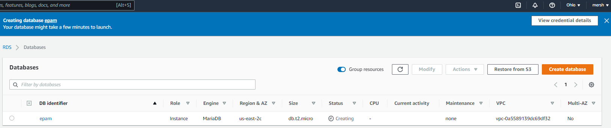
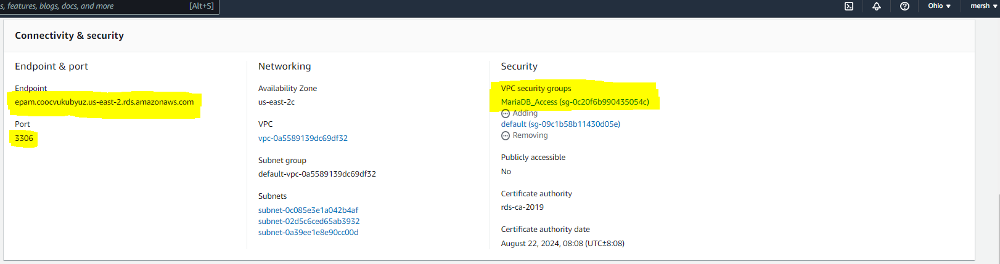
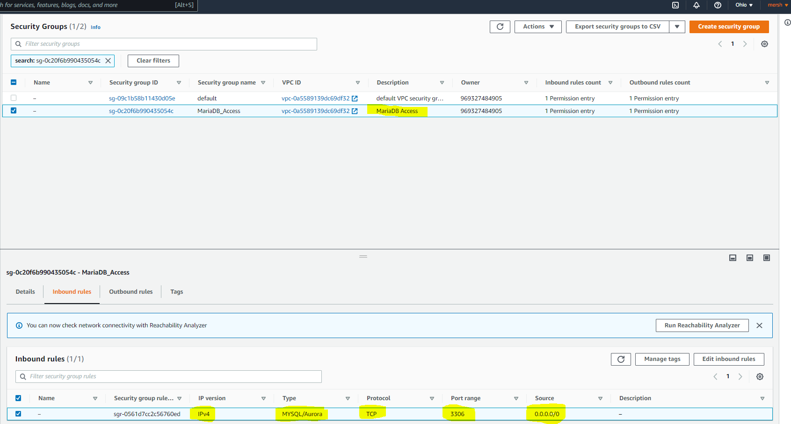
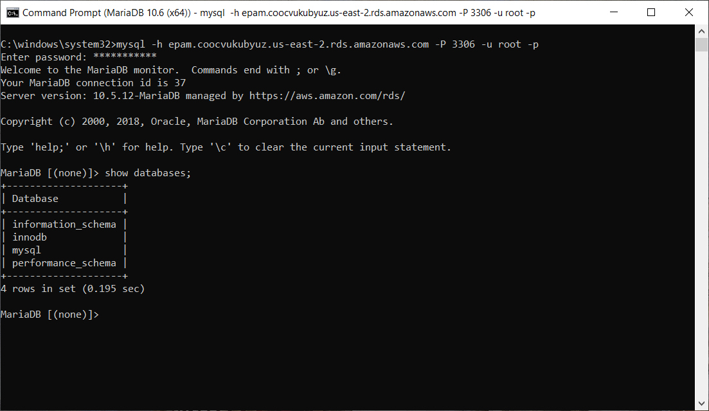
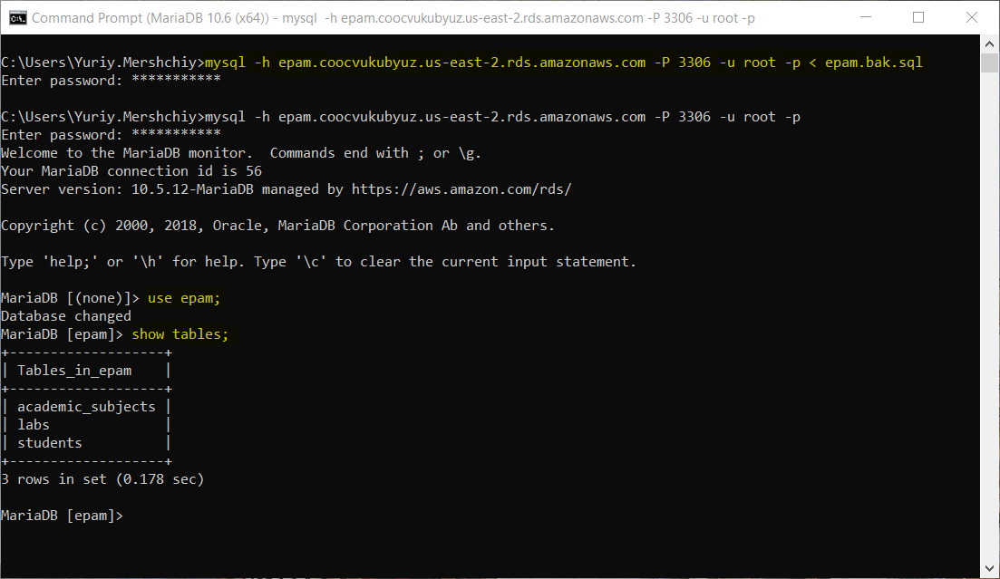
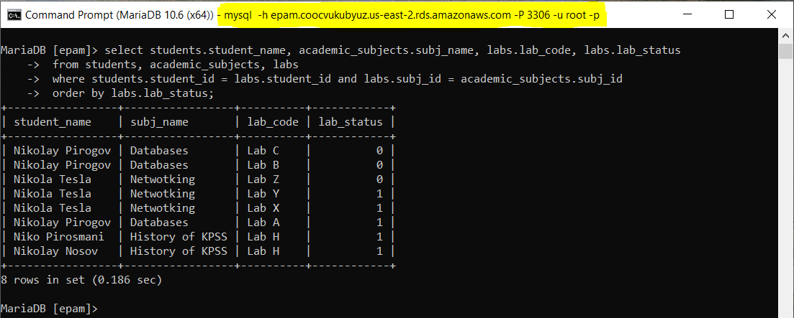
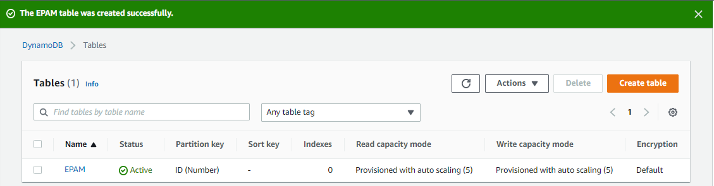
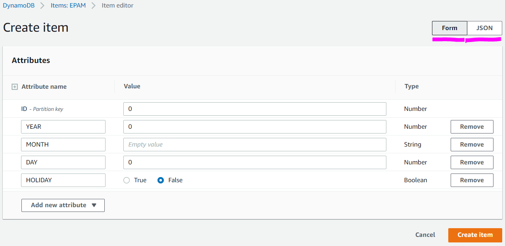
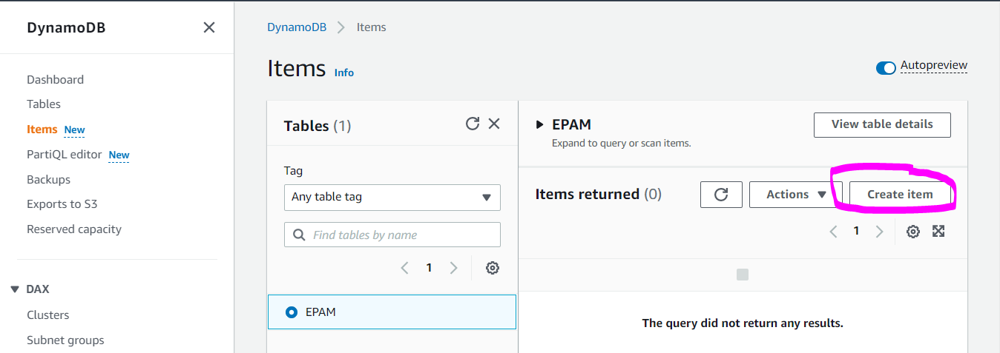
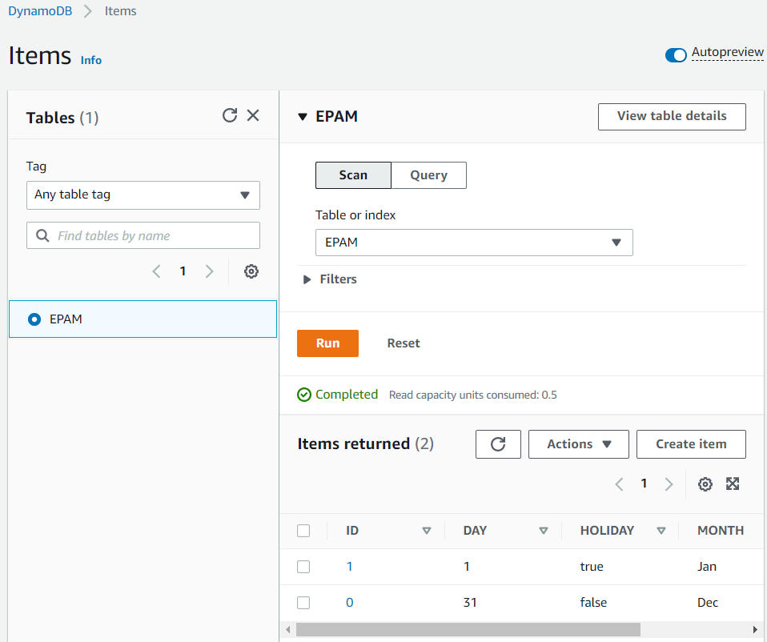

# EPAM DevOps Courses</h1>
## Lab 4.1 Databases</h2>
### Part A -- Local database exercises

<details><summary>Database schema and script for it creation</summary><br>


```sql
CREATE DATABASE IF NOT EXISTS epam;

USE epam;

CREATE TABLE IF NOT EXISTS labs (
    student_id int NOT NULL,
    subj_id int NOT NULL,
    lab_code varchar(12) NOT NULL,
    lab_status boolean NOT NULL 
);

CREATE TABLE IF NOT EXISTS students (
    student_id int NOT NULL PRIMARY KEY AUTO_INCREMENT,
    student_name varchar(50) NOT NULL 
);

CREATE TABLE IF NOT EXISTS academic_subjects (
    subj_id int NOT NULL PRIMARY KEY AUTO_INCREMENT,
    subj_name varchar(50) NOT NULL,
    subj_duration int NOT NULL 
);

ALTER TABLE `labs` ADD CONSTRAINT `fk_labs_student_id` FOREIGN KEY(`student_id`)
REFERENCES `students` (`student_id`);

ALTER TABLE `labs` ADD CONSTRAINT `fk_labs_subj_id` FOREIGN KEY(`subj_id`)
REFERENCES `academic_subjects` (`subj_id`);
```

</details>

<details><summary>Database creation</summary><br>


</details>

<details><summary>Data insertion</summary><br>

```sql
USE epam;

INSERT INTO academic_subjects (subj_name,subj_duration) 
VALUES('Netwotking',12), 
      ('Databases',3),
      ('Linux',12),  
      ('Git',3),
      ('VM',3), 
      ('Clouds',6),
      ('History of KPSS',48);

INSERT INTO students (student_name) 
VALUES('Nikola Tesla'), 
      ('Niko Pirosmani'),
      ('Nicolaus Copernicus'),
      ('Nikolay Pirogov'),
      ('Nikolay Nosov');

INSERT INTO labs (student_id,subj_id,lab_code,lab_status)
VALUES(1,1,'Lab X',true),
      (1,1,'Lab Y',true),
      (1,1,'Lab Z',false),
      (2,7,'Lab H',true),
      (4,2,'Lab A',true),
      (4,2,'Lab B',false),
      (4,2,'Lab C',false),
      (5,7,'Lab H',true);
```


</details>

<details><summary>Complex query</summary><br>

```sql
use epam;

select students.student_name, academic_subjects.subj_name, labs.lab_code, labs.lab_status
 from students, academic_subjects, labs
 where students.student_id = labs.student_id and labs.subj_id = academic_subjects.subj_id
 order by labs.lab_status;
```


</details>

### Part B -- RDS AWS database exercises

<details><summary>RDS AWS database creation and network security policy modification</summary><br>





</details>
<details><summary>Connection to RDS AWS database CLI and data restore from local backup</summary><br>




</details>
<details><summary>Complex query</summary><br>



</details>

### Part C -- Amazon DynamoDB exercises





