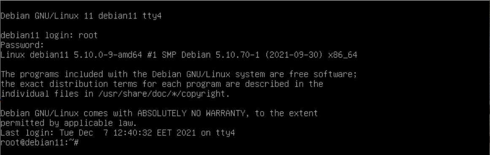
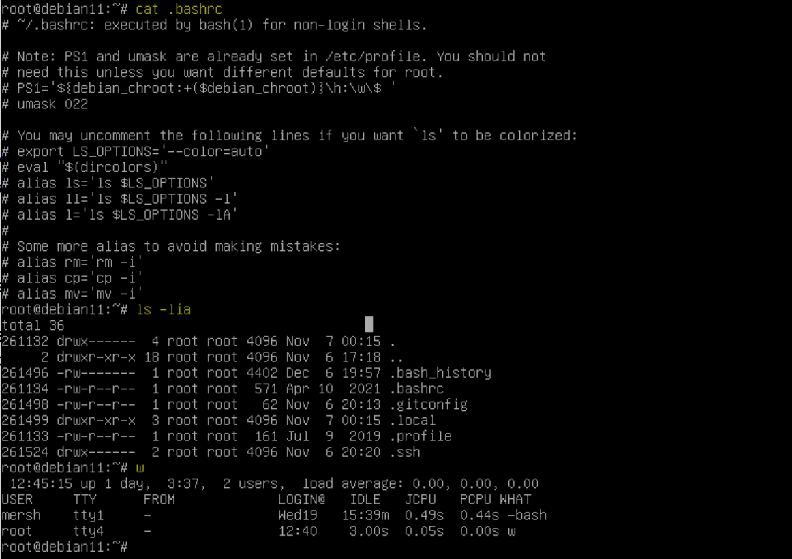
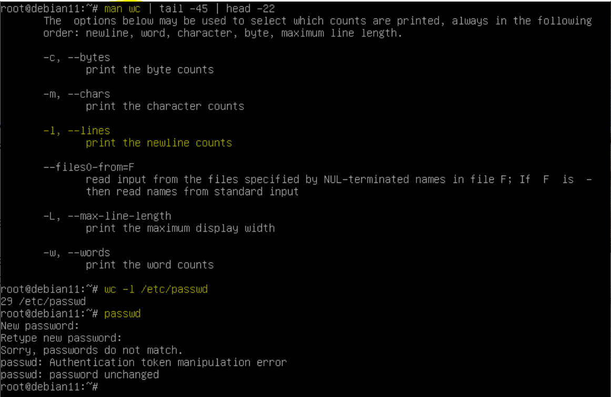
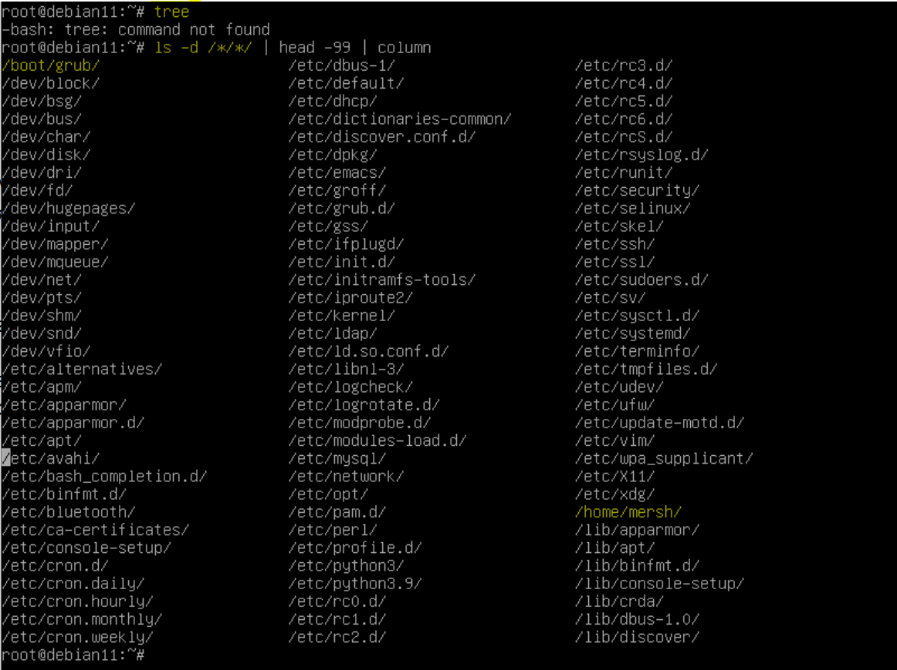
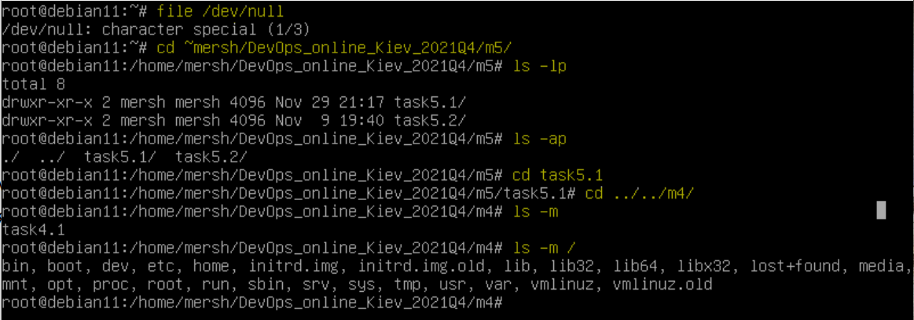
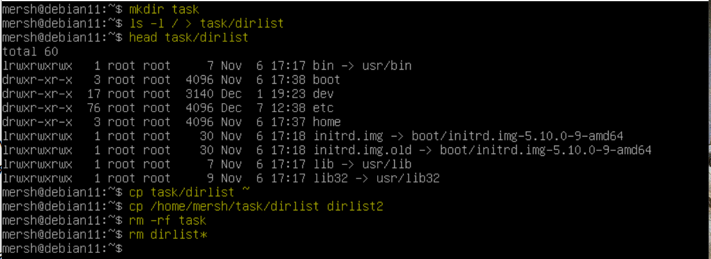
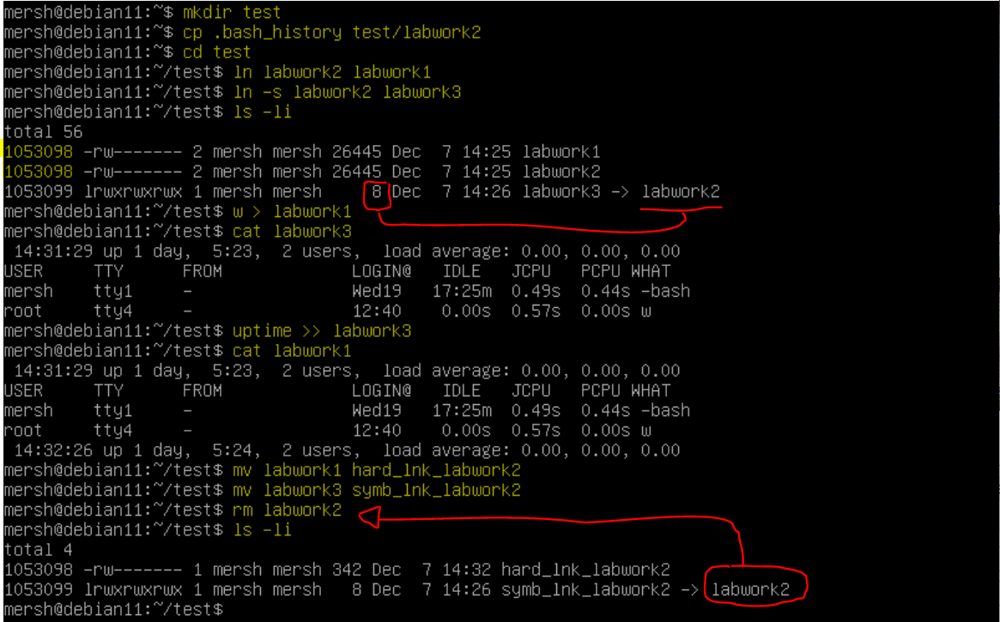
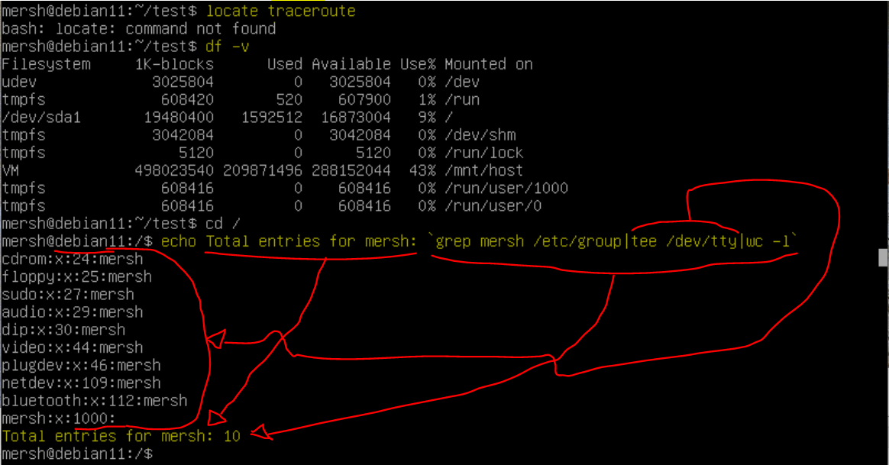
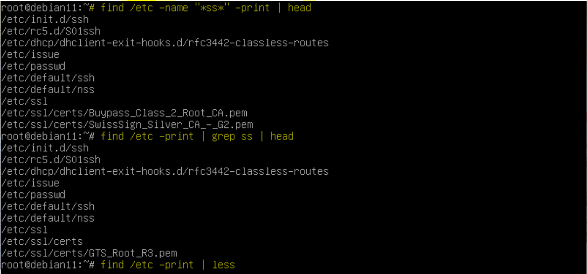
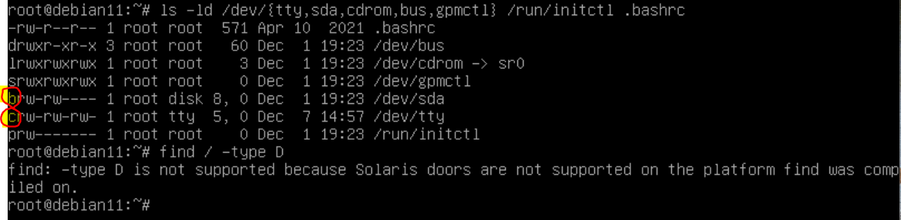

# EPAM DevOps Curses
## Lab 5.1 UNIX
### Part A

How to make logon to system, change password and use man

### Part B

Basics of UNIX file system, search and navigation

Size of file with symbolic link type is equal for length of target file name. In our example length of target file name is 8 (labwork2).

