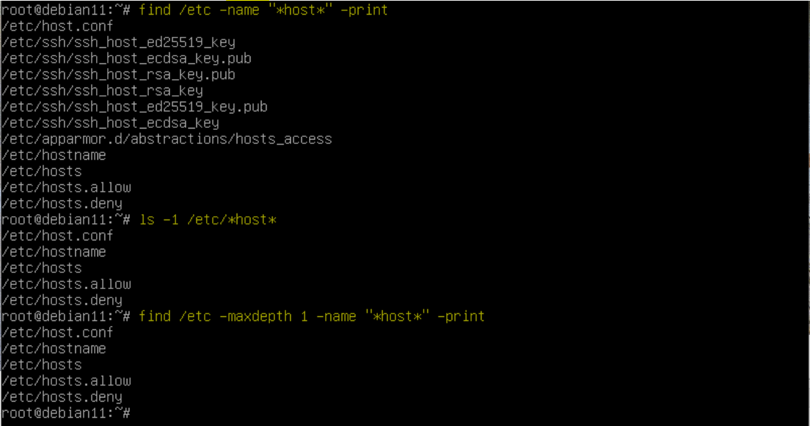

# EPAM DevOps Curses
## Lab 5.1 UNIX
### Part A

How to make logon to system, change password and use man

### Part B

Basics of UNIX file system, search and navigation

Size of symbolic link file is equal for length of target file name. In our example above length of target file name is 8 (labwork2).

Symbolic link will be broken if target file will be deleted.

In the example below we use the tee utility to duplicate the output of another command (on the left of tee) to the console. This command is inside the pipeline but first we see its output. This is because bash have to wait when pipeline done.

