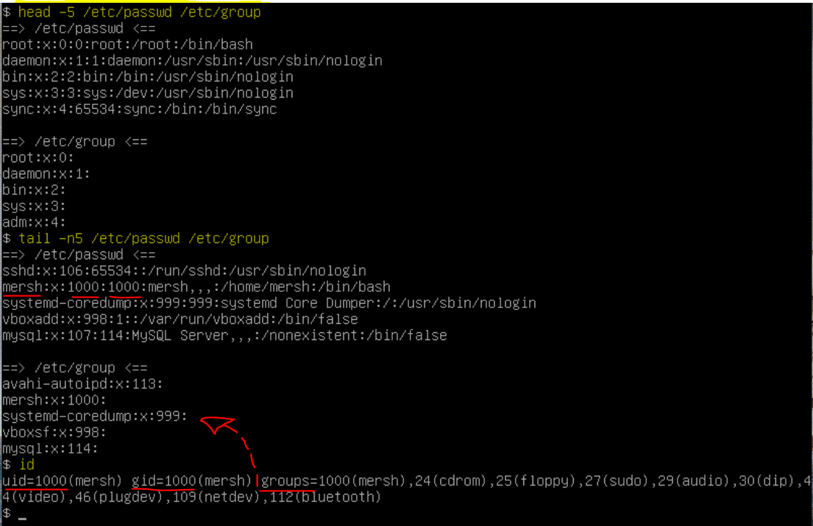
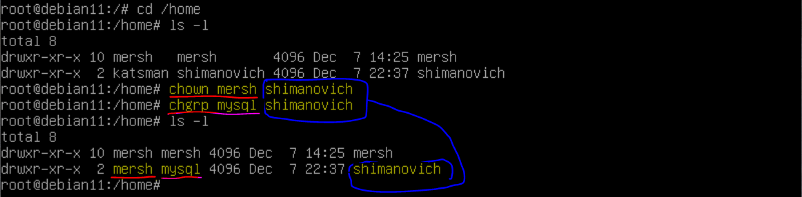
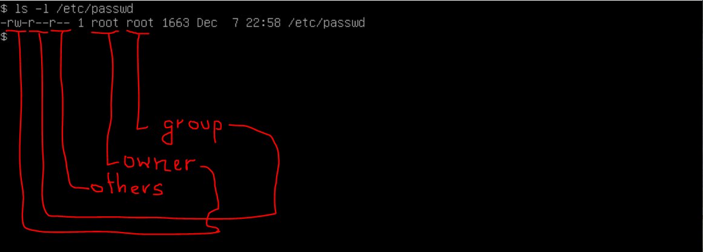
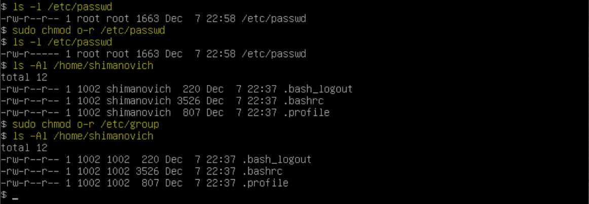
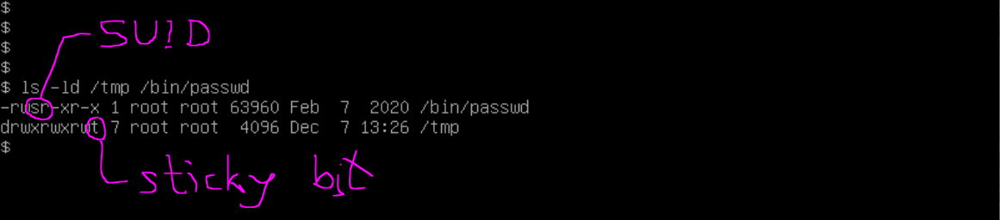
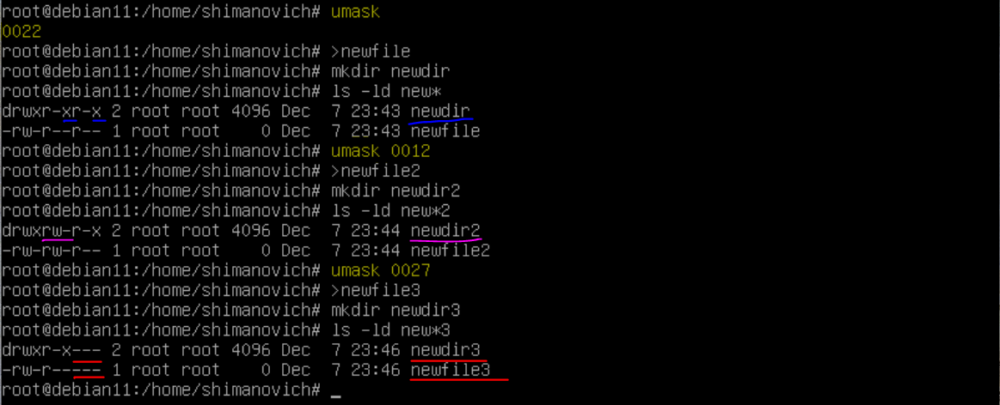
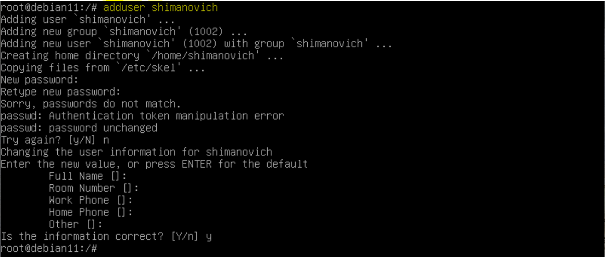
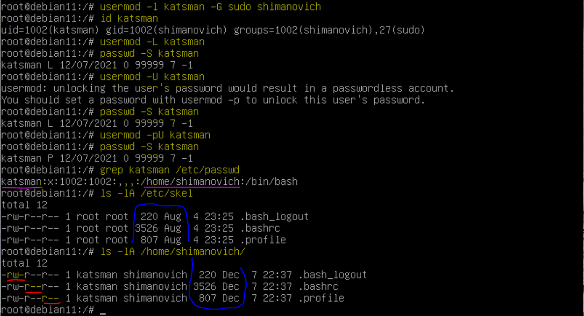

# EPAM DevOps Curses
## Lab 5.2 UNIX

How to manage user accounts. Understanding file permissions (modes) in UNIX.

 
/etc/passwd and /etc/group - two main files that are used to separate privileges.

They contain information about user and group names and their corresponding numeric identifiers (UID and GID. The user is a member of one or more groups. /etc/passwd contains the GID of the user's primary group, additional groups for this user are listed in /etc/group:

