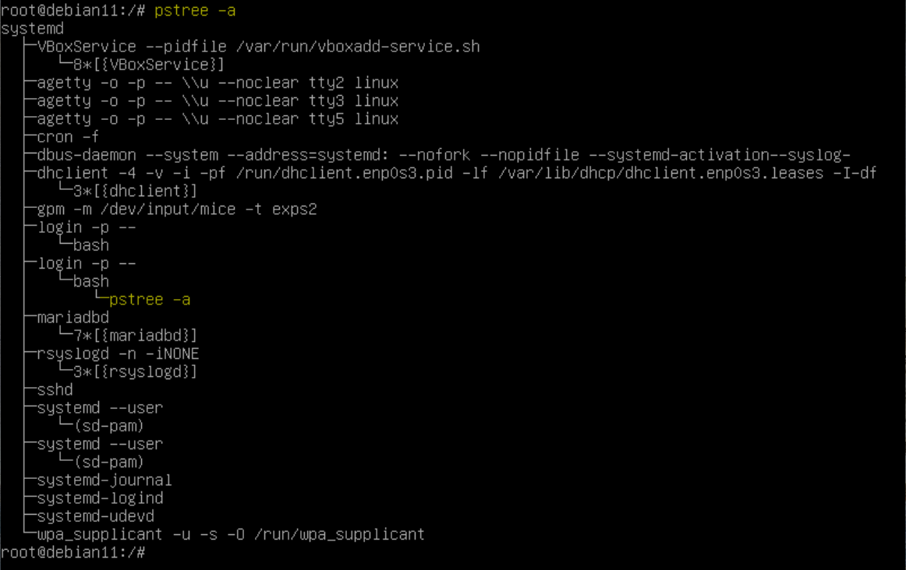
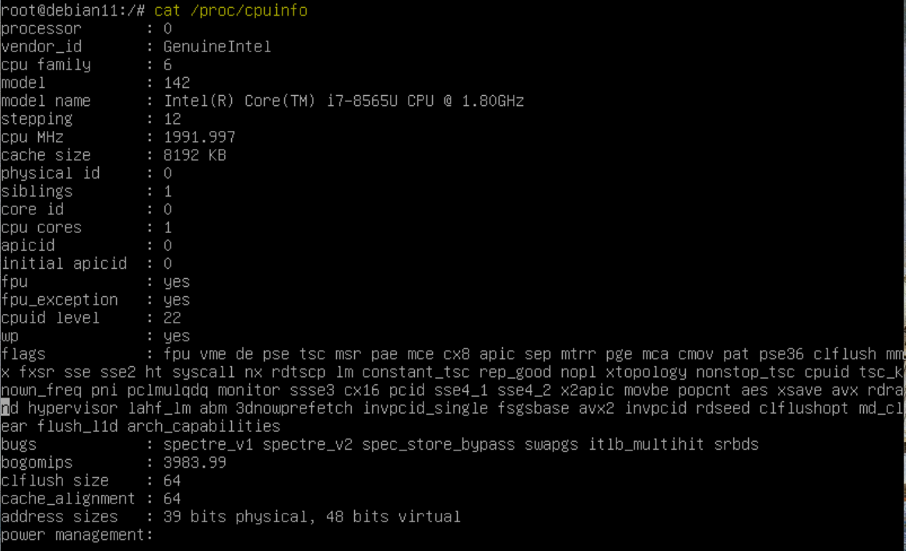
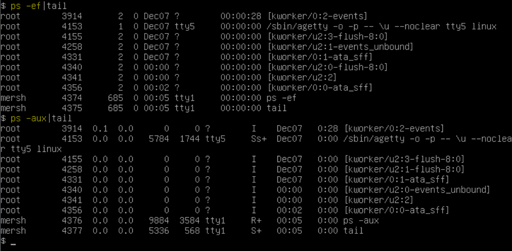
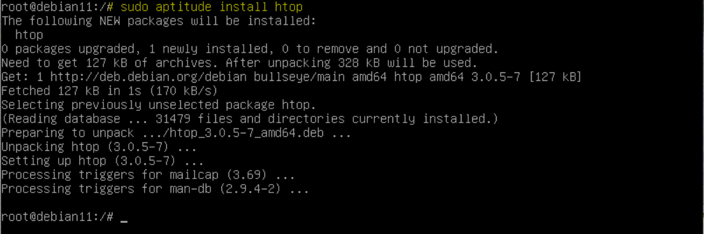
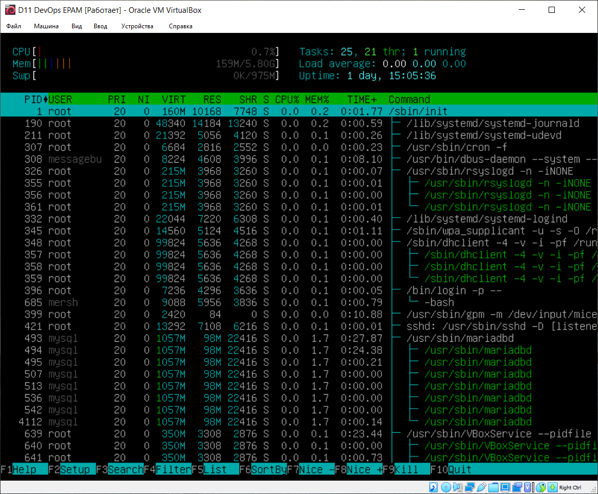

# EPAM DevOps Curses
## Lab 5.3 UNIX
### Part A

How to manage processes in UNIX

 
pstree utility shows parent processes and theirs childs:

The /proc file system contains all system information about the components that are currently running:

You can use ps utility on Linux with BSD or/and System V style options:

htop is realy useful utility that you "must have":

### Part B

How to secure an SSH connection

We did the same manipulations with SSH in the Lab 2.1 Part B:

