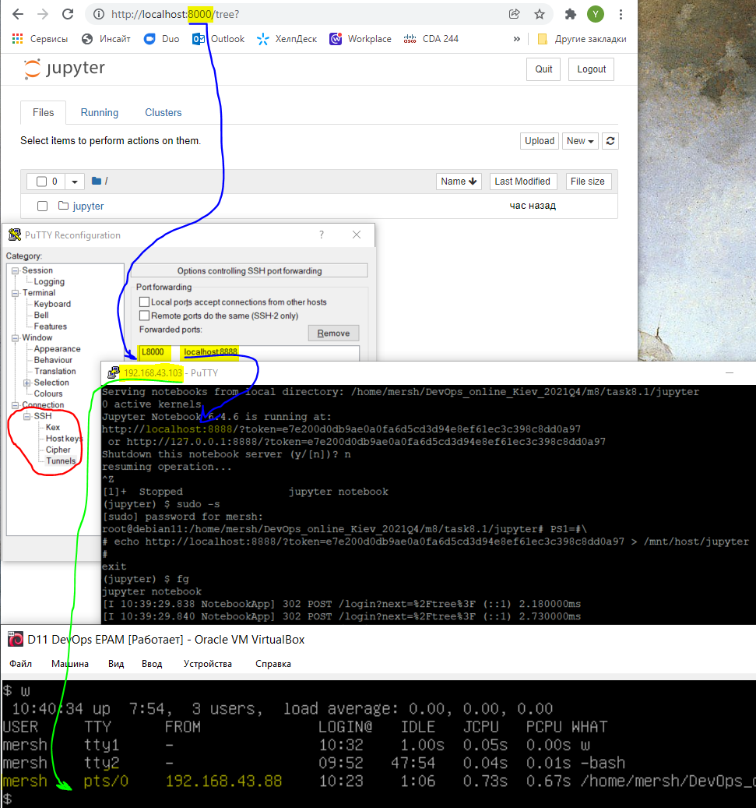
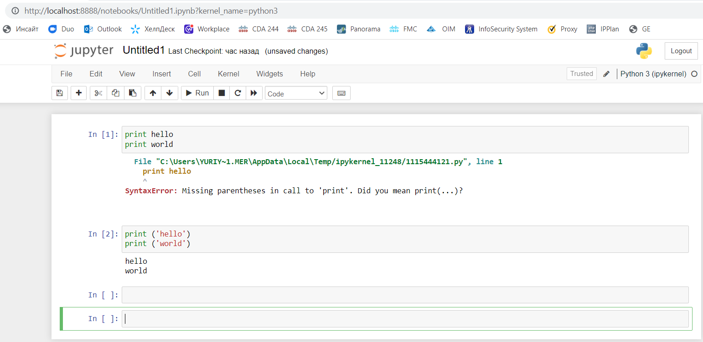
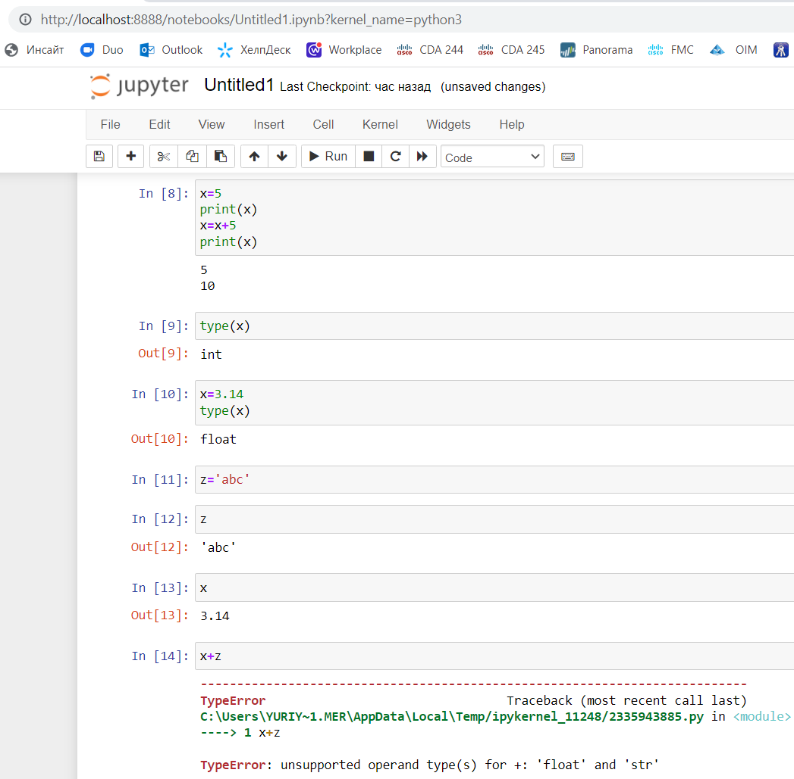
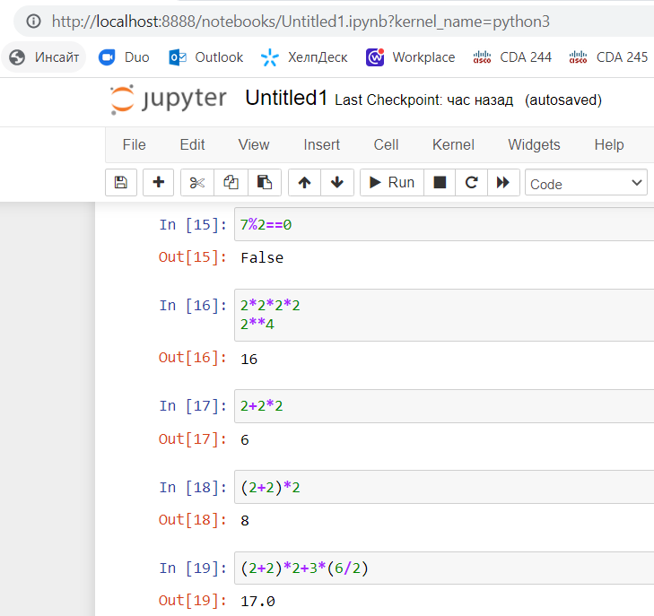
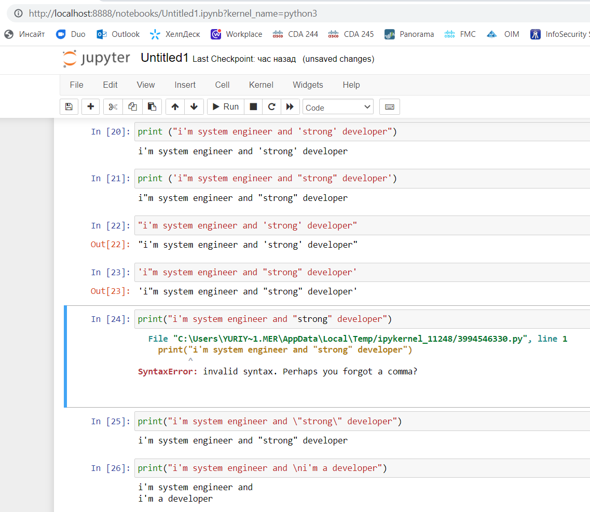
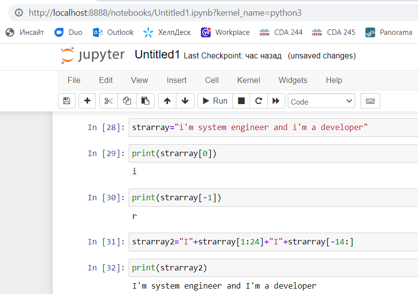
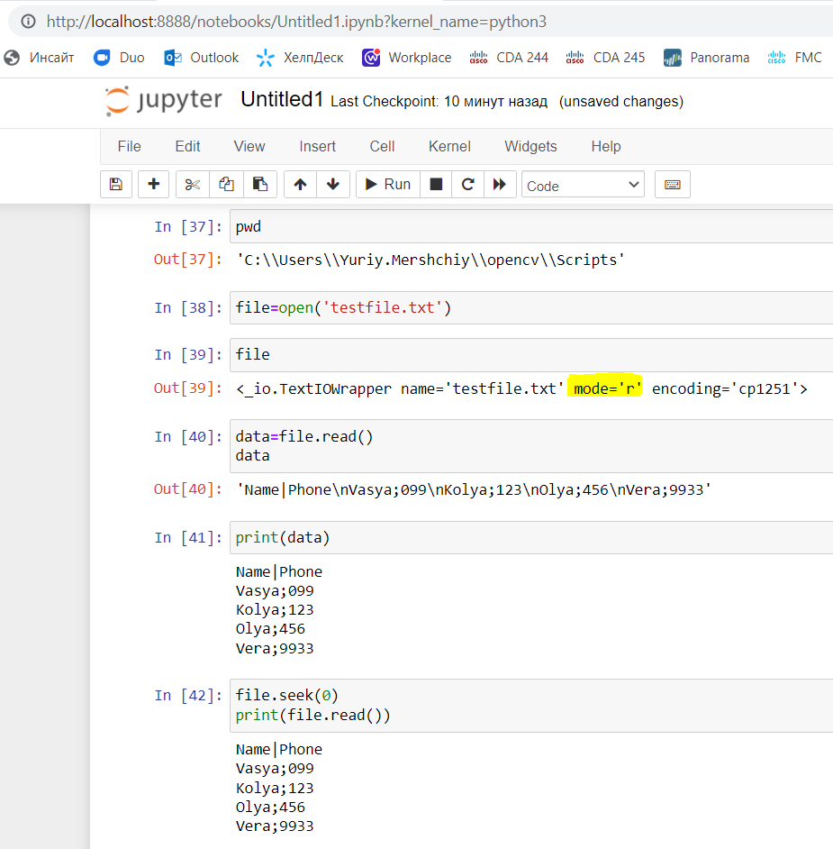
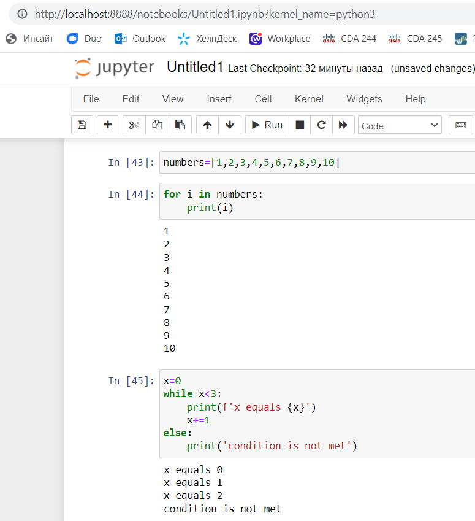
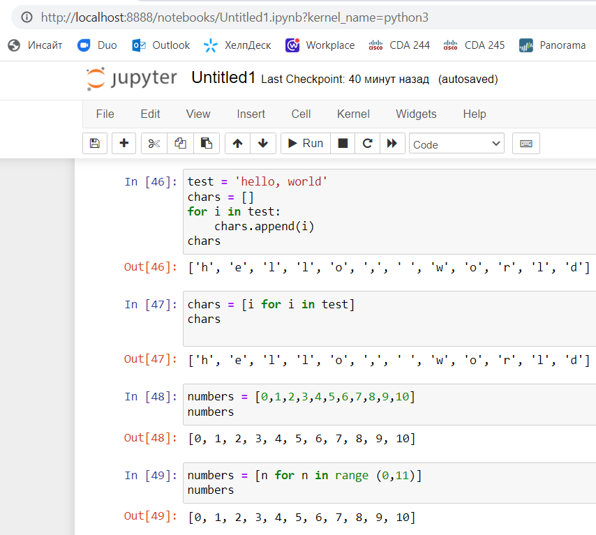

# EPAM DevOps Curses</h1>
## Laba 8.1 Python Scripting

### Part A / Jupyter Notebook Installation

- on Windows 10

done and easy to use inside local system

- on Debian 11

Jupyter was installed on a Debian 11 guest OS. Jupyter Notebook runs as a local web service on port 8888. To connect to it from the host OS, we need to use an SSH tunnel.

We can use PuTTY to create a tunnel. To configure the tunnel, we must go to Connection/SSH/Tunnels. There we set the source port to 8000 and the target socket to localhost:8888 (red line). After that, we can connect to the host OS and run Jupyter Notebook there (green line).

Now we can connect from the browser to the Jupyter Notebook. We have to use the URL that Jupyter Notebook prints after launch, like http://localhost:8888/?token=... (see the end of the blue line). But don't forget that we have to use 8000 instead of 8888 (see the begin of the blue line).

### Part B / Basic exercises

- A lot of screenshots

### Part C / Script
- <a href=laba8.py>laba8.py</a> source code
